# Polygonで問題作成からDOMjudgeに自動アップロードするまでの流れ

## まずはPolygonのアカウント登録
ブラウザでCodeforces polygon loginとか調べたらページが出てくるから、そこいってregisterするとおk。

## 早速問題作成

### 問題生成
ログインしてview problemsのところ行ったらこんな画面になる
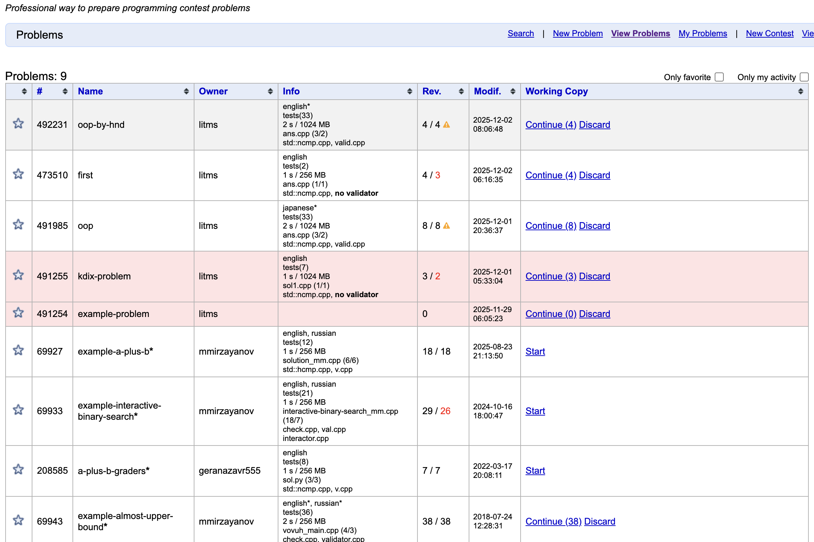


問題作成はNew Problemを押す。押したらまずは名前を決める。lowercaseのアルファベットか-のみ。
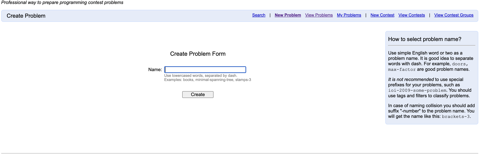

作成後view problemsのところに戻され、新たに問題が追加されているはずなので、その問題の行のStartを選択。

### 問題設定（実行時間制限とかメモリ制限など）
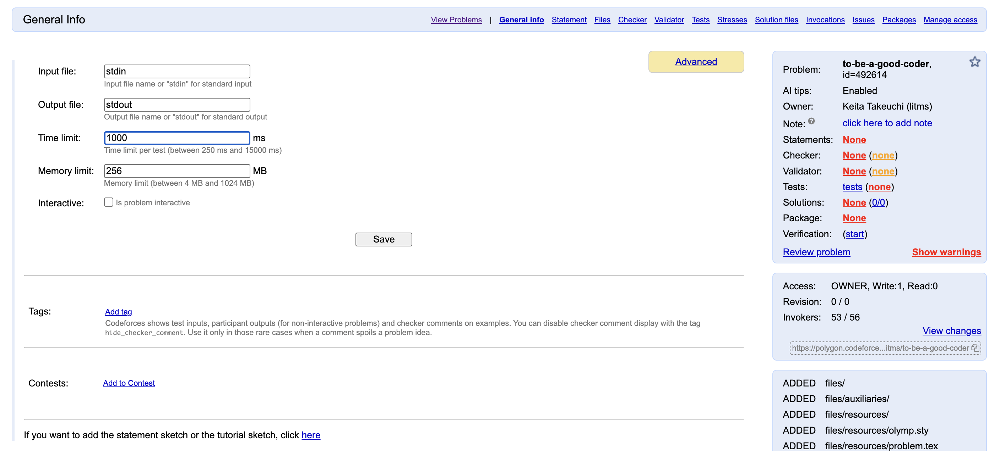
この画面では見ての通り、メモリ制約とか実行時間制限を決めることができる。好きに変更したら次にStatementに行って問題文の作成に取り掛かる（多分ここら辺に決まった順番ってない気がするから、先にテストケース作りたかったりしたら先そっち行ってもいい気がする）。

### 問題文設定　（注意書きだけ読むように）
画面上部にあるStatementをクリックすると次の画面に進む。
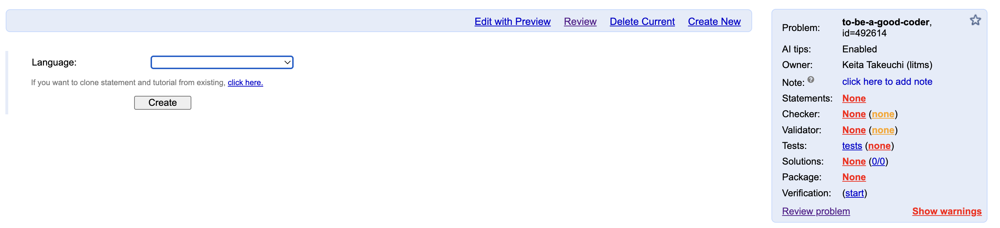
ここで注意しないといけないのは、問題文を日本語で書く場合もここのlanguage欄は必ずEnglishにすること。(のちに使うpol2dom（自動的にDOMJudgeに上げてくれるやつ）が問題文のファイルを見つけてくれなくなるため)

### 問題文作成
問題文の作成のページの説明は以下の通り
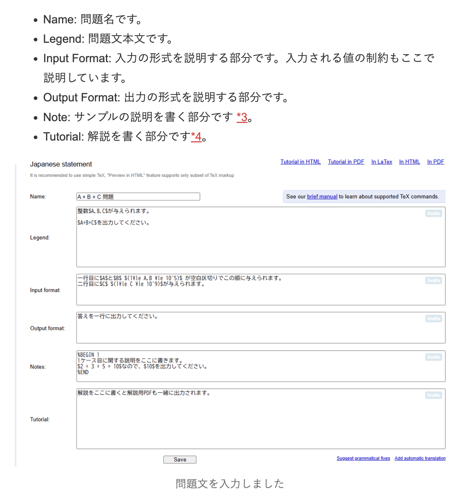
引用 https://daylight-pro.hatenablog.com/entry/2025/04/21/180000#Polygon%E3%81%A8%E3%81%AF

Notesのところはわかりづらいけど、
``` 
$BEGIN 1

$END

$BEGIN 2 

$END
```
とすることでi=1だったらサンプル1のものが、i=2だったらサンプル2の下に記述されるから便利。
LaTeX慣れてない場合は下のサイト見ながらやると楽 <br><br>
【LaTeX】数式記法・記号一覧チートシート + Previwer<br>
https://www.folklore.place/webtools/latex/previewer

また、制約とかの見た目がどんな感じなのかを見たかったら、画面上部にあるPreviewを押したら見れる。
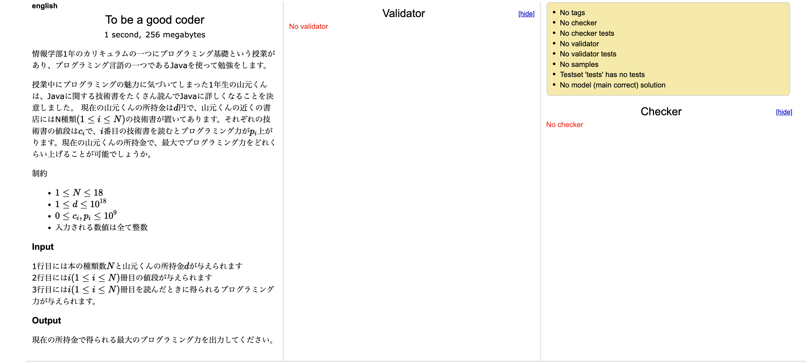

### テストケース作成（generatorの作成）
いくつかやり方はあるんだろうけど、今回はpolygon上で強く勧められているtestlibを使うため、c++を使って記述する（そんな難しくない）。

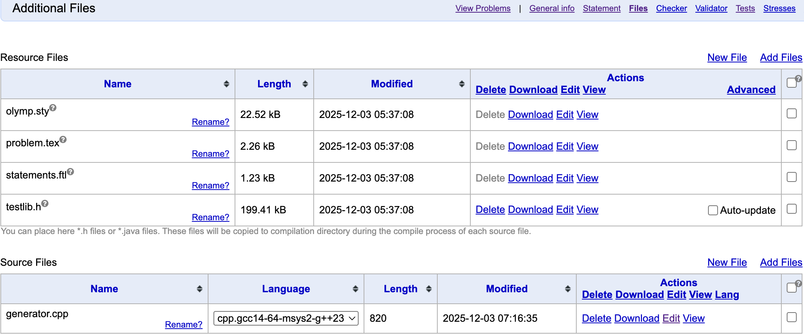
上部にあるfileを押したら、Source filesでNew File（ブラウザ上でコードを書くならこっち）、手元で作ってるなら（Add Files）をクリックする。testlib入れるのめんどくさかったからブラウザでコード書いてます。ちなみに、generatorの例がこのsource filesの下にリンクがあるからそれを読んだらだいたいわかる。

実際のコードはこんな感じ。何もエラーがなかったらsaveした時自動的にfilesのページに戻される。
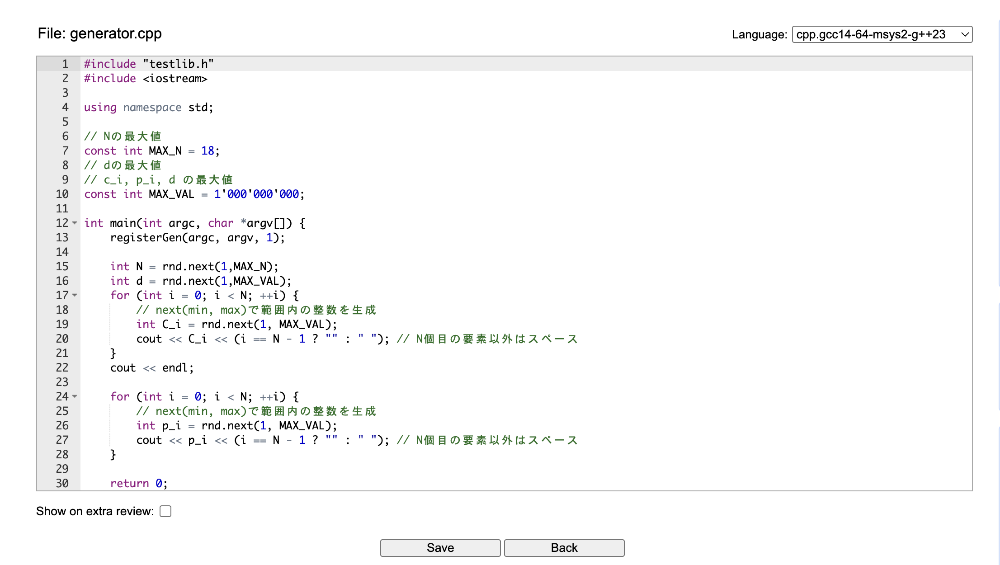

### テストケース作成（実際の作ったコードを動かす）
テストケースを作る方法は2通りある。まずは画面右上にあるAdd Testで追加する方法。これはサンプルケースで見せたい時や、コーナーケース、最大最小ケースを手動で作成するときに用いらた良い。それ以外の場合は下のScriptからコードを起動して、テストケースを作る方法が良い。
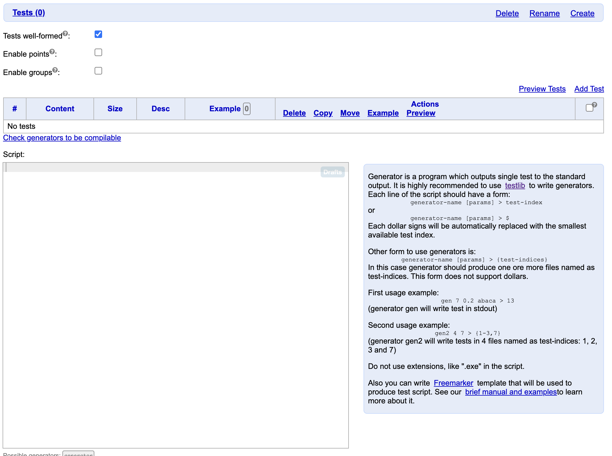

テストケースを作成が面はこんな感じ。 Use in statementsを選ぶと問題文のところに表示される。問題なかったらsaveで保存。
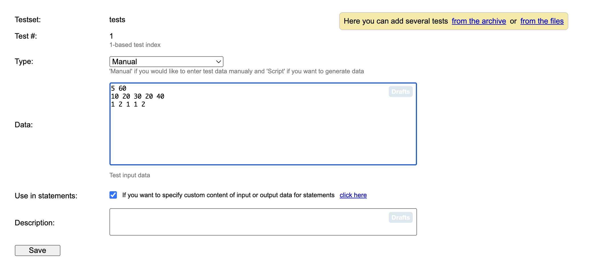

ランダムにサンプルケースを作る場合は以下のように作ったファイル名（拡張子は除く）、引数 > $ で実行させることができる。ケースの数はご自由に。 generator 数字が表示されていたら成功している。
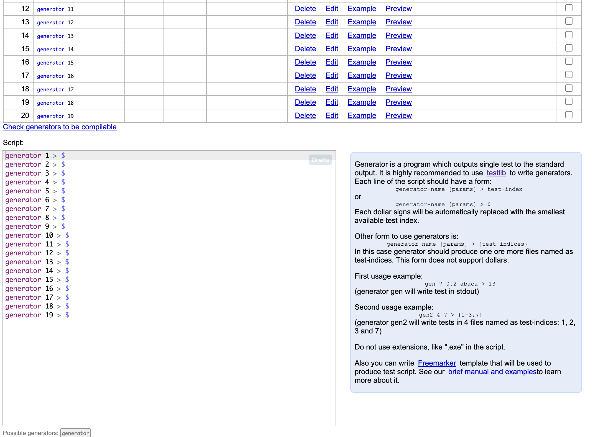

以上。これがテストケースの生成

### 解答例（正解コード）の作成
正誤判定するにせよ、解説を作るにせよ当たり前だけど正解（模範解答的な）ものがないと話にならないので、それを作りましょう。
と言っても、普通に答えのコードを書いて、画面上部にあるsolution filesに行って、そこからadd filesで正解コードを出したらそれで良い。
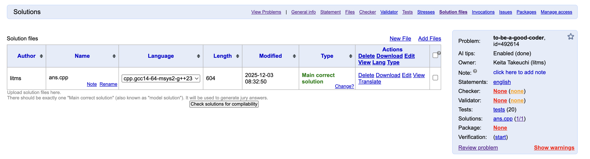

ちなみに、正解コードを記述する以外にも別解のコード、もしくは通ってしまいそうだけど本当は間違えのコードとかをここに入れておくと、嘘解法を減らせたりすることもできるので、積極的に入れておくと良い。TypeのChangeのところを選択すると、acceptedとかwrong answerとかTLEとか選択肢があるので、いずれかを選択すること。
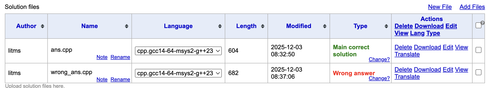

また、画面右にあるtranslateを押すと言語をAIが変換してくれる機能があるらしい。ちゃんと動作するかどうかとかは確認はしないといけないけど、結構便利かも。
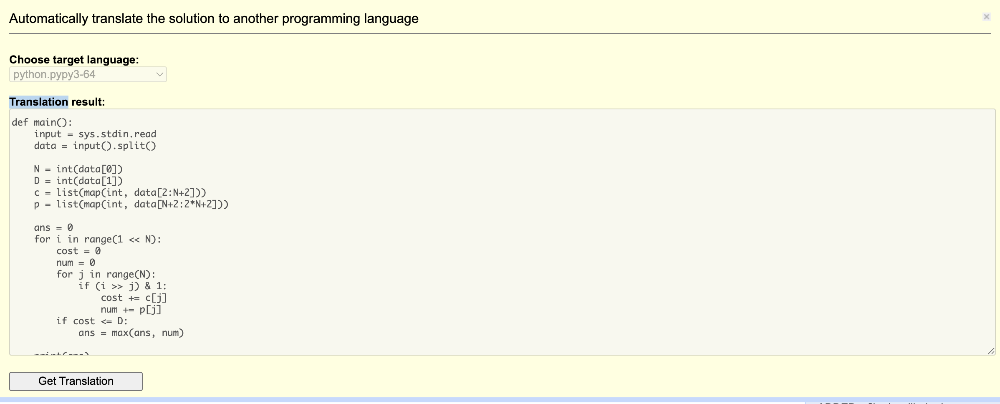

### Validatorの作成（生成されたテストケースに制約違反が含まれていないかどうかのチェック）
万が一制約違反などが含まれていたら問題として成り立たなくなってしまうので、しっかりと作っておくべき。とはいえ（複雑な問題作らない限り）そんな難しいことはしない。詳しくは上部のvalidatorを作成したときに現れる右のexampleの中を見よう。（ファイル選択や作成の流れは今まで同じなので割愛します）
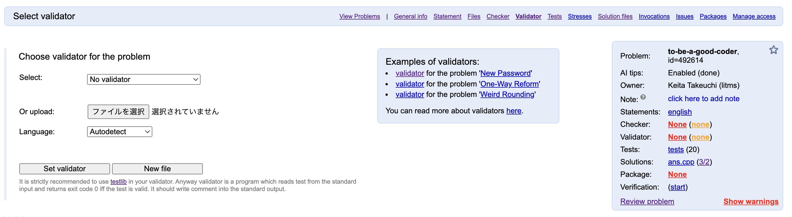
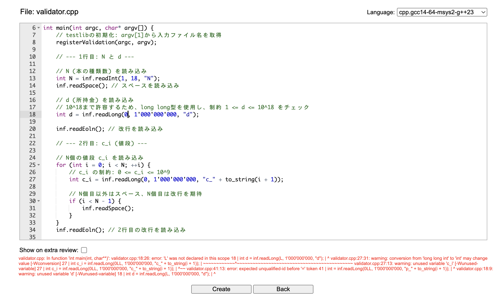

### checker（正誤判定）を作ろう
これがないと提出コードがあっているかどうかの判定ができません。とはいえ、基本的なたとえばYes/Noタイプとか、最大値最小値問題的なやつはすでにpolygon側で用意されているから作らなくていい（たとえばインタラクティブとかいっぱい独自の文字列を表示するとかは作らないといけない）。詳しくはExample見てください。
使うやつを選択もしくはインポートしたらあとはsetして終わり。ここら辺で一旦書かないといけないことは終わりました（解説とかは各自でちゃんと書いてください）。
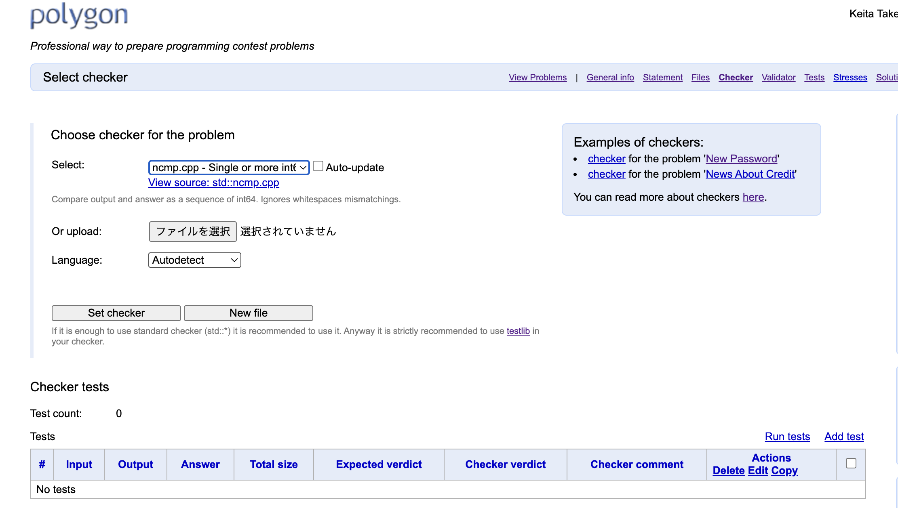
整数系ならncmpで良さそう

### 色々作業したらコミットしよう
ここまで全部やったけど、基本的に複数人で作業することが多い。だから、定期的にコミットをして進捗を他のチームメンバーにも反映したい（現在の状態はただ単にlocalStorageに保管されているだけ）。別に難しいことはなく画面右下にいくとCommit Changeがあるから、それを押してコミットメッセージを追加して終わり。
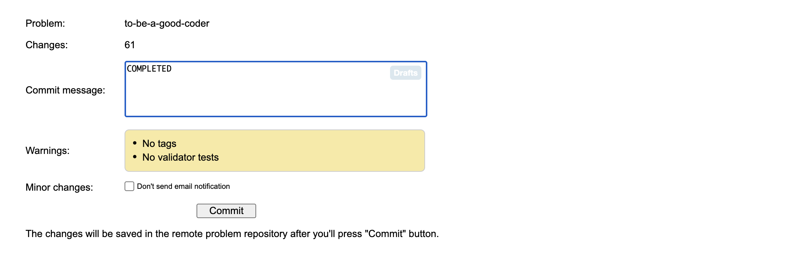

### テストして、何かあったら修正、何もなかったら終わり！！
最後に確認しましょう。ボタンぽちぽちするだけです。画面上部のInvocationに行って、画面左上にある Want to run solution?を押しましょう。そしたら確認したいプログラム、確認したいテストケースを選択してRun Judgementを押しましょう！！
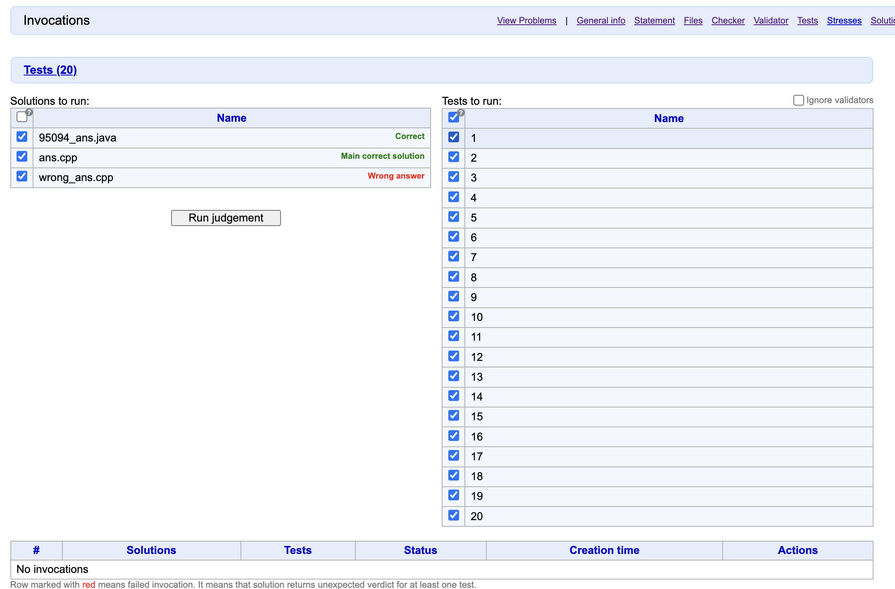

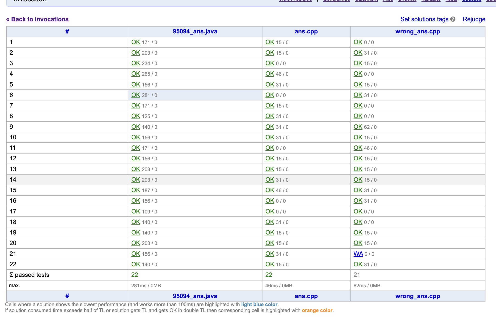


### テストが終わったら
ここまで全部終わったらPackagesのところに行って問題データ諸々をダウンロードできるようにする。画面右上にあるCreate PackageのFullを押せば基本的にはオッケー。（ちなみにこの時点で何か足りてない制約とか、不足していそうな部分があったらある程度はプログラム側が教えてくれる便利な機能がある。）
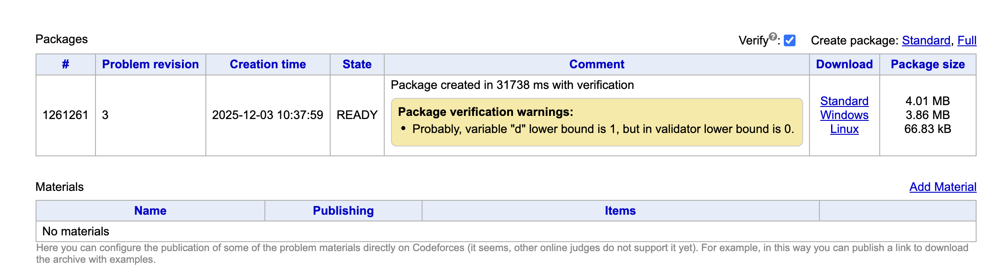

## 次にpol2domの使い方
多分英語で問題を作成したりする分には何も困らないんだけど、日本語にしているせいでファイルをいじらないといけないのがめんどくさい。
とりあえずpol2domのリポジトリはこれ
- https://github.com/dario2994/pol2dom
<br>
まずはここの最初に載っている
```
$ pipx install git+https://github.com/dario2994/pol2dom
```
を実行する。これでpythonのパッケージをインストールできる。そしたら次に、このパッケージがインストールされた場所(which p2d)で表示されたところにいく。
私のところだと
- /Library/Frameworks/Python.framework/Versions/3.13/lib/python3.13/site-packages/p2d
にあった。

そこのフォルダにいくと、
- tex_utilities.py
- sources/document_template.tex
というファイルがあるはず。これらをこのリポジトリに貼り付けたものと取り替える（もしくはコードの内容をコピペ）。コードの変更はこれでおけ（のはず）。

それが終わったらあとは実行するんだけど、ちょっと準備が必要。

## pol2domのconfig設定
一応pol2domを実行するときにはコンテスト専用のフォルダを作っておいた方が良い。シンプルに<br>
Kindai_contest<br>    L config.yaml<br>
みたいな感じ。(要するにcontestフォルダの中にconfig.yamlがある状態ということです...)
そのconfig.yamlの中身なんだけど、それもp2d_filesの中に例を貼っているので、それを参考にしてもらえれば多分大丈夫。
あとは
```
p2d contest_directory --polygon --convert --domjudge --pdf
```
を実行して終わり！！お疲れ様でした。